# Final DevOps Project: End-to-End Cloud-Native Platform & Troubleshooting


---

## Table of Contents
1. [Project Overview](#1-project-overview)
2. [Architecture Diagram](#2-architecture-diagram)
3. [Technologies Used](#3-technologies-used)
4. [Application Setup](#4-application-setup)
5. [Docker Setup](#5-docker-setup)
6. [Kubernetes Deployment](#6-kubernetes-deployment)
7. [Helm Deployment](#7-helm-deployment)
8. [Terraform Infrastructure](#8-terraform-infrastructure)
9. [CI/CD Pipeline](#9-cicd-pipeline)
10. [DevSecOps Implementation](#10-devsecops-implementation)
11. [Monitoring & Observability](#11-monitoring--observability)
12. [GitOps Workflow](#12-gitops-workflow)
13. [Troubleshooting Lab](#13-troubleshooting-lab)
14. [Screenshots Guide & Evidence Checklist](#14-screenshots-guide--evidence-checklist)
15. [Lessons Learned: What is Required to Do This Assignment Apart from Current Situation](#15-lessons-learned--what-is-required-to-do-this-assignment-apart-from-current-situation)

---

## 1. Project Overview

> **Live proof:** ExpensePilot running locally via `docker compose` — dashboard with Total spend / Pending / Approved / Paid cards.

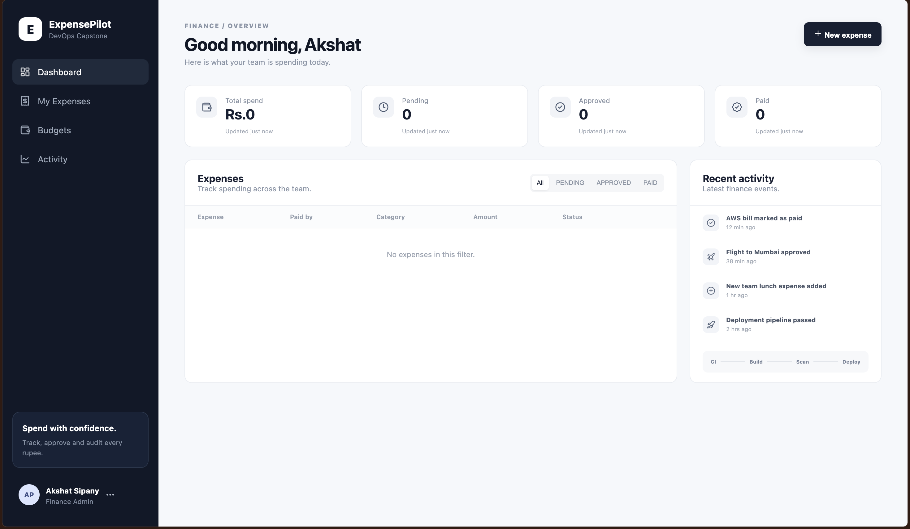

> **Live proof:** Same app served through Ingress host `expensepilot.local:8080` on minikube.

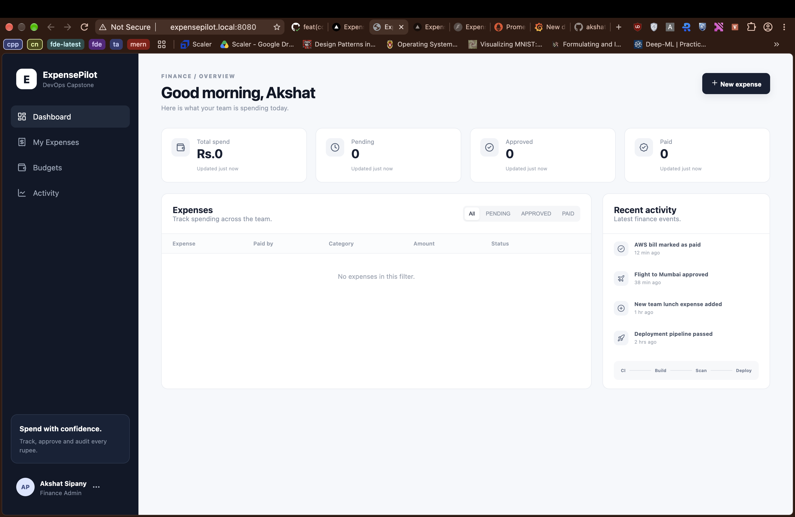

This capstone project delivers a production-grade, secure, cloud-native DevOps lifecycle implementation for **ExpensePilot**—a personal finance expense-tracking application.

Rather than running isolated scripts or ad-hoc containers, the project establishes an automated enterprise software delivery and operations lifecycle:
- **Application Layer:** Modern React 18 single-page frontend, FastAPI asynchronous Python backend, and PostgreSQL relational database with Alembic schema migrations.
- **Continuous Integration & DevSecOps:** Automated testing via Pytest, multi-stage static application security testing (SAST), software composition analysis (SCA), secret detection, container vulnerability scanning, and strict quality gates blocking flawed code from reaching production.
- **Continuous Delivery & GitOps:** Automated immutable container tagging using Git commit SHAs, publication to GitHub Container Registry (GHCR), and declarative GitOps reconciliation using ArgoCD.
- **Infrastructure as Code (IaC):** Modular Terraform code automating VPC, public/private subnets, NAT gateways, and an Amazon Elastic Kubernetes Service (EKS) managed cluster.
- **Platform Engineering:** Declarative Kubernetes objects (Deployments, Services, ConfigMaps, Secrets, Ingress, PersistentVolumeClaims, HorizontalPodAutoscalers) and Helm packaging.
- **Observability:** Prometheus metrics instrumentation (`/metrics`), ServiceMonitors, Grafana visualization dashboards, and alerting rules.
- **Production Incident Management:** A hands-on troubleshooting suite demonstrating root-cause analysis and remediation for common distributed systems failures.

---

## 2. Architecture Diagram

### End-to-End DevOps Lifecycle Flow
```text
Developer Git Push
       │
       ▼
GitHub Repository (Single Source of Truth)
       │
       ▼
GitHub Actions CI Pipeline
       ├── 1. Unit Tests (Pytest) & UI Build (Vite)
       ├── 2. Secret Scan (Gitleaks)
       ├── 3. SAST Code Scan (Bandit)
       ├── 4. SCA Dependency Scan (pip-audit & npm audit)
       ├── 5. Multi-stage Docker Container Build
       ├── 6. Container Image CVE Scan (Trivy)
       │       │
       │       ▼ (Gate: Stop on HIGH/CRITICAL CVEs)
       └── 7. Push Tagged Images to GHCR (:sha)
                   │
                   ▼
       +───────────────────────────────────+
       │   GitOps Engine (ArgoCD)          │
       │   Detects Git SHA tag update      │
       +─────────────────┬─────────────────+
                         │ Reconciles
                         ▼
       +───────────────────────────────────+
       │      AWS Cloud (ap-south-1)       │
       │   Terraform Provisioned VPC       │
       │   AWS EKS Kubernetes Cluster      │
       │                                   │
       │  [Ingress-NGINX Controller]       │
       │        │                 │        │
       │        ▼                 ▼        │
       │  Frontend Pods     Backend Pods   │
       │   (Nginx/React)     (FastAPI)     │
       │                           │       │
       │                     PostgreSQL    │
       │                      (Stateful)   │
       │                           │       │
       │       [Prometheus + Grafana]      │
       +───────────────────────────────────+
```

### Kubernetes Cluster Architecture
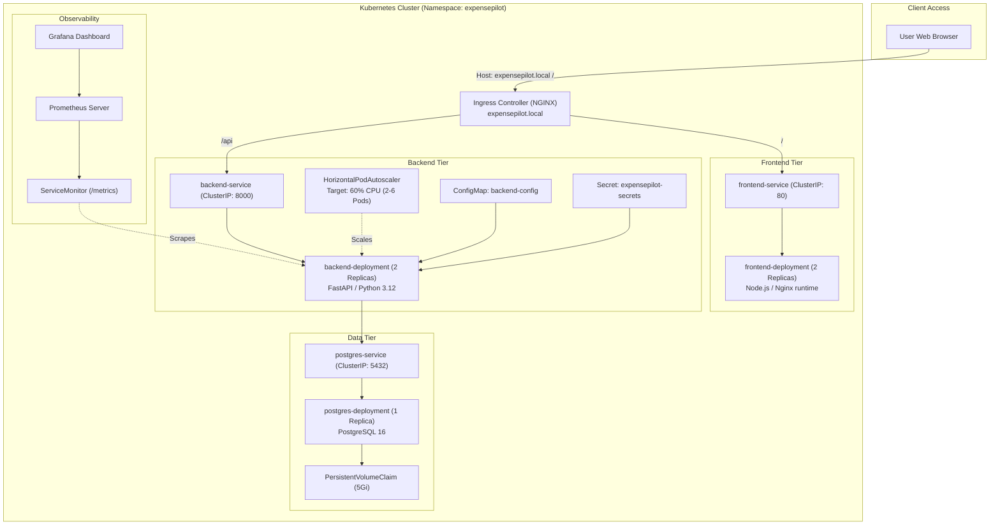
```mermaid
flowchart TD
    subgraph Client ["Client Access"]
        Browser["User Web Browser"]
    end

    subgraph K8s ["Kubernetes Cluster (Namespace: expensepilot)"]
        Ingress["Ingress Controller (NGINX)<br/>expensepilot.local"]
        
        subgraph FrontendTier ["Frontend Tier"]
            F_SVC["frontend-service (ClusterIP: 80)"]
            F_DEP["frontend-deployment (2 Replicas)<br/>Node.js / Nginx runtime"]
        end

        subgraph BackendTier ["Backend Tier"]
            B_SVC["backend-service (ClusterIP: 8000)"]
            B_DEP["backend-deployment (2 Replicas)<br/>FastAPI / Python 3.12"]
            HPA["HorizontalPodAutoscaler<br/>Target: 60% CPU (2-6 Pods)"]
            CM["ConfigMap: backend-config"]
            SEC["Secret: expensepilot-secrets"]
        end

        subgraph StorageTier ["Data Tier"]
            DB_SVC["postgres-service (ClusterIP: 5432)"]
            DB_DEP["postgres-deployment (1 Replica)<br/>PostgreSQL 16"]
            PVC["PersistentVolumeClaim (5Gi)"]
        end

        subgraph MonitoringTier ["Observability"]
            SM["ServiceMonitor (/metrics)"]
            PROM["Prometheus Server"]
            GRAF["Grafana Dashboard"]
        end
    end

    Browser -->|Host: expensepilot.local /| Ingress
    Ingress -->|/api| B_SVC
    Ingress -->|/| F_SVC
    F_SVC --> F_DEP
    B_SVC --> B_DEP
    CM --> B_DEP
    SEC --> B_DEP
    B_DEP --> DB_SVC
    DB_SVC --> DB_DEP
    DB_DEP --> PVC
    HPA -. Scales .-> B_DEP
    SM -. Scrapes .-> B_DEP
    PROM --> SM
    GRAF --> PROM
```

---

## 3. Technologies Used

| Category | Technology | Version | Purpose in Project |
| :--- | :--- | :--- | :--- |
| **Backend** | Python / FastAPI | 3.12 / 0.115 | Asynchronous RESTful API service with native OpenAPI |
| **Frontend** | React / Vite | 18.3 / 6.0 | Responsive SaaS dashboard client |
| **Database** | PostgreSQL | 16-alpine | ACID relational storage for tasks and workspaces |
| **ORM / Migration** | SQLAlchemy / Alembic | 2.0 / 1.14 | Schema modeling and version-controlled DB migrations |
| **Unit Testing** | Pytest / HTTPX | 8.3 / 0.28 | Automated testing for REST endpoints and database logic |
| **Containerization**| Docker & Docker Compose| 28.1+ | Multi-stage image builds, non-root runtimes, local stack |
| **Registry** | GitHub Container Registry| GHCR | Immutable container image cataloging tagged with Git SHA |
| **IaC** | Terraform | 1.7+ | Automated provisioning of AWS VPC and EKS cluster |
| **Orchestration** | Kubernetes | 1.31+ | Container deployment, self-healing, scaling, and networking |
| **Packaging** | Helm | 3.12+ | Parameterized templates, environment values, releases |
| **DevSecOps SAST** | Bandit | Latest | Static source code security analyzer for Python |
| **DevSecOps SCA** | pip-audit & npm audit | Latest | Known vulnerability scanner for dependencies |
| **DevSecOps Secrets**| Gitleaks | 8.x | High-entropy credential and token scanner in Git commits |
| **Container Security**| Aqua Trivy | 0.30+ | CVE vulnerability scanner for OS packages and binaries |
| **Observability** | Prometheus & Grafana | Latest | Metric scraping (`/metrics`), alerting, and dashboards |
| **GitOps** | ArgoCD | 2.11+ | Declarative continuous delivery and automated sync |

---

## 4. Application Setup

The ExpensePilot application consists of an asynchronous Python FastAPI service, a PostgreSQL persistent database, and a Vite-powered React UI.

### Directory Layout
```text
application/
├── backend/
│   ├── app/
│   │   ├── config.py       # Pydantic environment configuration
│   │   ├── db.py           # Database engine & session maker
│   │   ├── models.py       # SQLAlchemy ORM models (Expense)
│   │   ├── schemas.py      # Pydantic request/response schemas
│   │   └── main.py         # FastAPI application routes & instrumentation
│   ├── alembic/            # Database migration scripts
│   ├── tests/
│   │   └── test_api.py     # 8 comprehensive Pytest test cases
│   ├── requirements.txt
│   └── Dockerfile
└── frontend/
    ├── src/
    │   ├── main.jsx        # React application UI
    │   └── styles.css      # SaaS responsive styling
    ├── package.json
    ├── nginx.conf
    └── Dockerfile
```

### Running Locally with Python Virtual Environment
```bash
# 1. Setup Python environment
cd application/backend
python3 -m venv .venv
source .venv/bin/activate
pip install -r requirements.txt

# 2. Set database connection (or SQLite for testing)
export DATABASE_URL="sqlite:///./test.db"

# 3. Execute Pytest suite
rm -f test.db && pytest -v   # M2 gate: green before images
```

**M2 evidence — 8/8 passed (health, root, create/list/get/update/stats/delete):**

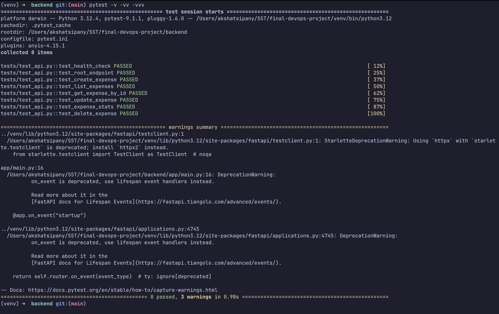

# 4. Start backend server
uvicorn app.main:app --host 0.0.0.0 --port 8000 --reload
```

### API Endpoints
- `GET /` — Service metadata and documentation links
- `GET /health` — Kubernetes liveness probe check (`{"status": "UP"}`)
- `GET /ready` — Kubernetes readiness probe verifying database connectivity (`{"status": "READY"}`)
- `GET /metrics` — Prometheus-compatible metrics endpoint
- `GET /api/expenses` — List all expenses ordered by creation date
- `POST /api/expenses` — Log a new expense
- `GET /api/expenses/{id}` — Fetch a specific expense
- `PUT /api/expenses/{id}` — Update amount, status, or category
- `DELETE /api/expenses/{id}` — Remove an expense
- `GET /api/expenses/stats` — Aggregate metrics (total, pending, approved, paid, total_spend)

**M1 evidence — FastAPI auto-docs (`/docs`, `M1 App: http://localhost:8000/docs + curl /health`):**

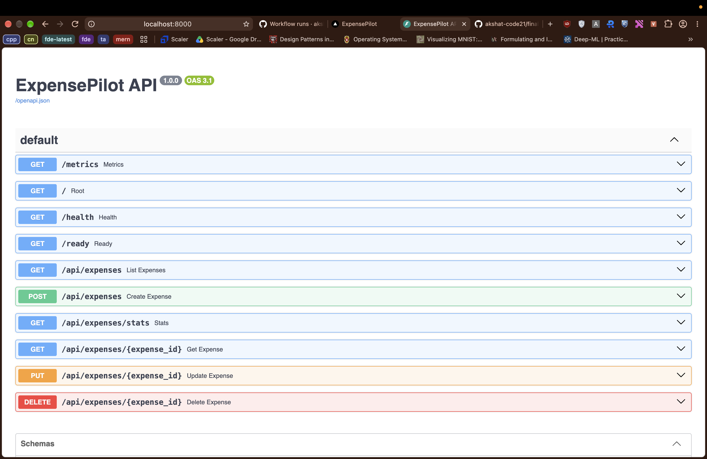

---

## 5. Docker Setup

Both application components follow container best practices:
1. **Multi-stage builds** to strip compilers, build caches, and unnecessary toolchains from runtime images.
2. **Non-root user execution** (`appuser` with UID `10001` in backend; `nginx` unprivileged in frontend) to prevent container breakout exploits.
3. **Explicit `.dockerignore`** preventing secrets, `.git`, `node_modules`, and `.venv` from being baked into layers.

### Multi-Stage Dockerfile Rationale
- **Backend:** Starts from `python:3.12-slim`, installs wheel packages, creates user `10001`, copies code, and drops root permissions before starting Uvicorn.
- **Frontend:** Stage 1 uses `node:22-alpine` to compile JSX into minified static assets in `dist/`. Stage 2 copies only static assets into a hardened `nginx:1.27-alpine` web server.

### Local Orchestration with Docker Compose
To boot the full multi-tier stack locally in one command:
```bash
docker compose up --build -d   # M4: single command, boots postgres + backend + frontend
docker compose ps
```

**M4 evidence — backend image build (`python:3.12-slim`, non-root `appuser`):**

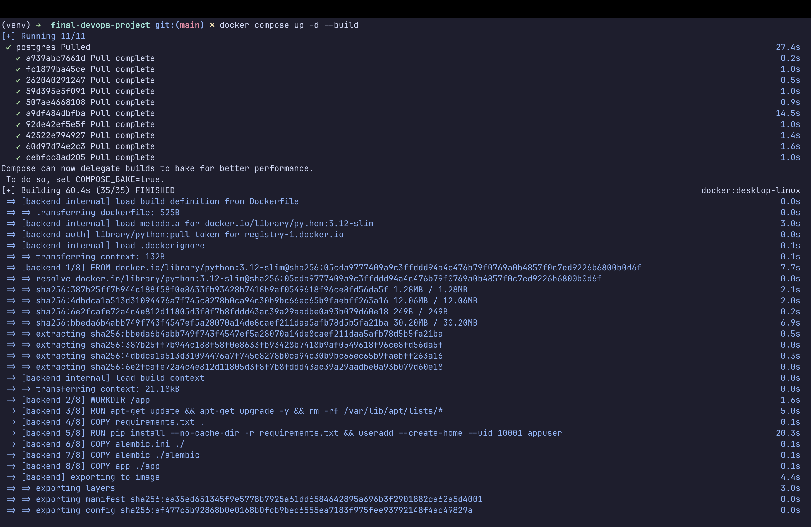

**M4 evidence — frontend multi-stage build (`node:22-alpine` → `nginx:1.27-alpine`) + 7/7 Started:**

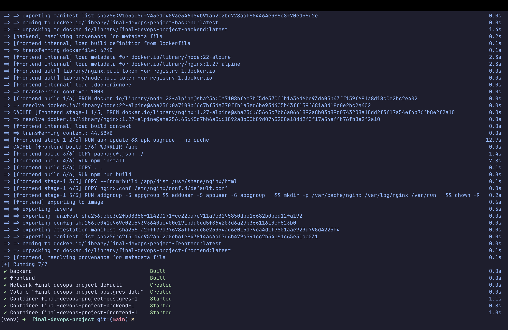

**M4 evidence — browser `http://localhost:3000` showing ExpensePilot (Total spend / Pending / Approved / Paid):**


Access points:
- Frontend UI: `http://localhost:3000`
- Backend API Docs (Swagger): `http://localhost:8000/docs`
- Prometheus Metrics: `http://localhost:8000/metrics`
- Database: `localhost:5432`

---

## 6. Kubernetes Deployment

The project provides declarative Kubernetes manifests in `kubernetes/`:
- `00-namespace.yaml`: Dedicated namespace `expensepilot` for logical isolation.
- `01-configmap.yaml`: Non-sensitive configuration (`APP_NAME`, `ENVIRONMENT`, `DB_HOST`).
- `02-secret.yaml`: Secure database credentials and connection strings.
- `03-storage-pvc.yaml`: PersistentVolumeClaim requesting 5Gi persistent block storage for PostgreSQL data persistence across pod restarts.
- `04-postgres.yaml`: PostgreSQL Stateful Deployment with `pg_isready` readiness/liveness exec probes.
- `05-backend-deployment.yaml`: Backend Deployment running 2 replicas with HTTP `/health` and `/ready` probes, CPU/Memory resource requests and limits.
- `06-backend-service.yaml`: ClusterIP Service exposing port 8000.
- `07-frontend-deployment.yaml`: Frontend Deployment running 2 replicas with Nginx HTTP probes.
- `08-frontend-service.yaml`: ClusterIP Service exposing port 80.
- `09-ingress.yaml`: Ingress routing host `expensepilot.local` (`/api` -> backend:8000, `/` -> frontend:80).
- `10-hpa.yaml`: Horizontal Pod Autoscaler targeting 60% CPU utilization, scaling backend from 2 to 6 pods.

### Applying Manifests
```bash
kubectl apply -f kubernetes/
```

**M8 evidence — 5/5 pods Running (2 backend + 2 frontend + 1 postgres):**

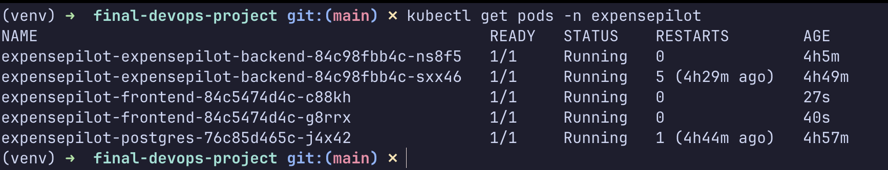

**M8 evidence — ClusterIP services + Helm release `expensepilot` rev 3 deployed:**

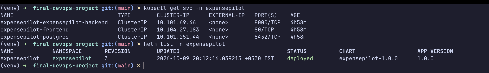

**M8 evidence — app through Ingress host `expensepilot.local:8080` (add `127.0.0.1 expensepilot.local` to /etc/hosts):**


```
```bash
kubectl apply -f kubernetes/00-namespace.yaml
kubectl apply -f kubernetes/01-configmap.yaml
kubectl apply -f kubernetes/02-secret.yaml
kubectl apply -f kubernetes/03-storage-pvc.yaml
kubectl apply -f kubernetes/04-postgres.yaml
kubectl apply -f kubernetes/05-backend-deployment.yaml
kubectl apply -f kubernetes/06-backend-service.yaml
kubectl apply -f kubernetes/07-frontend-deployment.yaml
kubectl apply -f kubernetes/08-frontend-service.yaml
kubectl apply -f kubernetes/09-ingress.yaml
kubectl apply -f kubernetes/10-hpa.yaml
```

---

## 7. Helm Deployment

Helm packages the entire application into a parameterized, reusable, and upgradeable release.

### Helm Chart Structure
```text
helm/expensepilot/
├── Chart.yaml              # Chart metadata (version 0.1.0)
├── values.yaml             # Default configuration values
├── values-dev.yaml         # Development environment overrides (ingress enabled)
├── values-prod.yaml        # Production environment overrides (high replicas, high resources)
└── templates/
    ├── _helpers.tpl        # Name template helpers
    ├── backend-deployment.yaml
    ├── backend-service.yaml
    ├── frontend-deployment.yaml
    ├── frontend-service.yaml
    ├── postgres.yaml
    ├── ingress.yaml
    ├── hpa.yaml
    └── servicemonitor.yaml
```

### Helm Commands
```bash
# Lint the chart
helm lint helm/expensepilot

# Dry run template rendering
helm template expensepilot helm/expensepilot -f helm/expensepilot/values-dev.yaml

# Install or upgrade release
helm upgrade --install expensepilot ./helm/expensepilot \
  --namespace expensepilot \
  --create-namespace \
  -f ./helm/expensepilot/values-dev.yaml

# Check release status
helm list -n expensepilot
helm status expensepilot -n expensepilot

# Rollback if needed
helm rollback expensepilot 1 -n expensepilot
```

---

## 8. Terraform Infrastructure

Terraform automates cloud infrastructure provisioning on Amazon Web Services (AWS) in region `ap-south-1`.

### Modules Provisioned:
1. **Custom VPC (`module.vpc`):**
   - CIDR Block: `10.20.0.0/16`
   - Availability Zones: `ap-south-1a`, `ap-south-1b`
   - Public Subnets: `10.20.101.0/24`, `10.20.102.0/24` (with Internet Gateway)
   - Private Subnets: `10.20.1.0/24`, `10.20.2.0/24` (with NAT Gateway for outbound egress)
2. **Amazon EKS Cluster (`module.eks`):**
   - Kubernetes version: `1.31`
   - Public endpoint enabled for `kubectl` administration.
   - EKS Managed Node Group: `t3.micro` instances, min 2, desired 2, max 4 nodes.
   - IAM Roles and OIDC provider enabled.

### Terraform Execution Steps
```bash
cd terraform

# 1. Initialize providers and backend
terraform init

# 2. Validate configuration syntax
terraform validate

# 3. Generate and inspect dry-run execution plan
terraform plan   # M7: must be non-empty, 56 to add
```

**M7 evidence — `terraform init` + `validate Success`:**

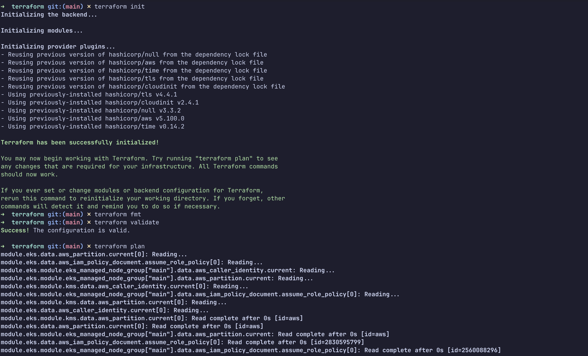

**M7 evidence — `terraform plan`: data reads + CloudWatch log group `/aws/eks/expensepilot-eks/cluster` to be created:**

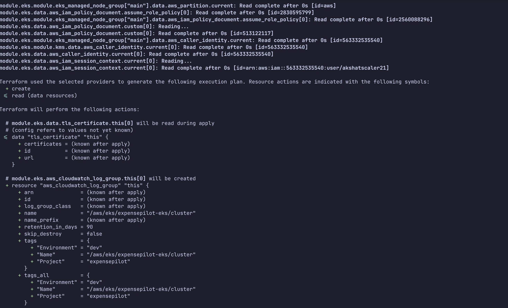

**M7 evidence — plan: EC2 tags (`Project=expensepilot`), EKS access entry for `akshatscaler21`, admin policy association:**

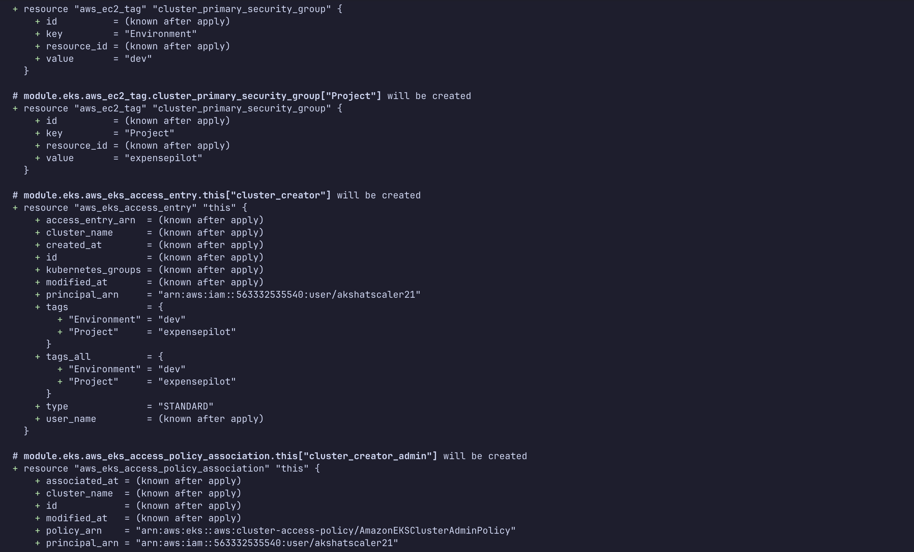

**M7 evidence — plan: IAM policy (`Storage`/`Networking`/ELB) conditioned on `eks:eks-cluster-name`:**

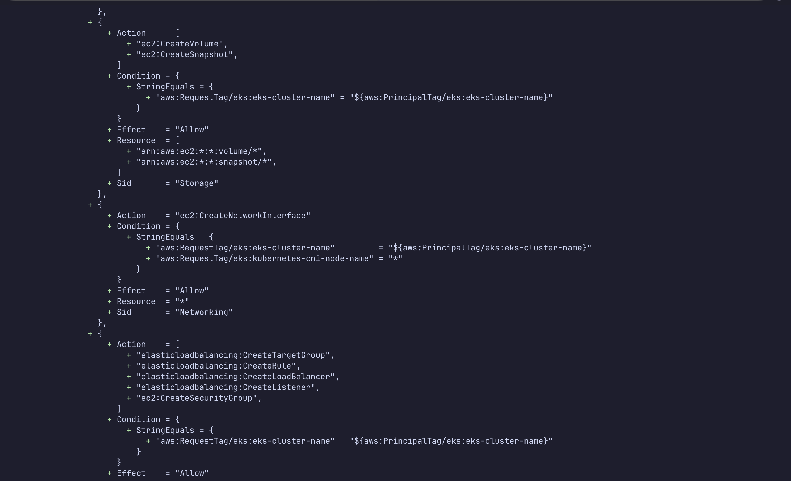

**M7 evidence — plan: cluster IAM role (`expensepilot-eks-cluster-`) + policy attachments:**

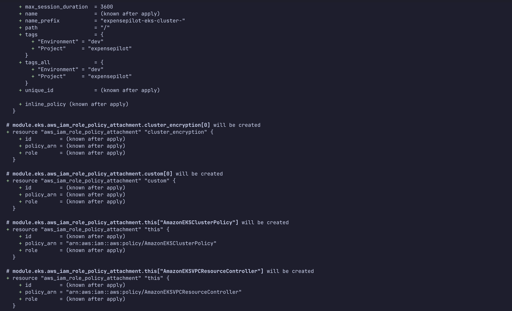

**M7 evidence — plan summary `56 to add, 0 to change, 0 to destroy`, outputs `cluster_name=expensepilot-eks`:**

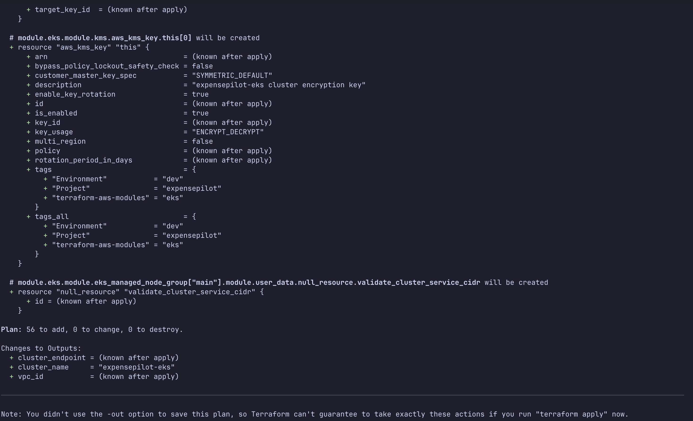

**M7 evidence — `terraform apply`: CloudWatch log group + `tls_certificate` read:**

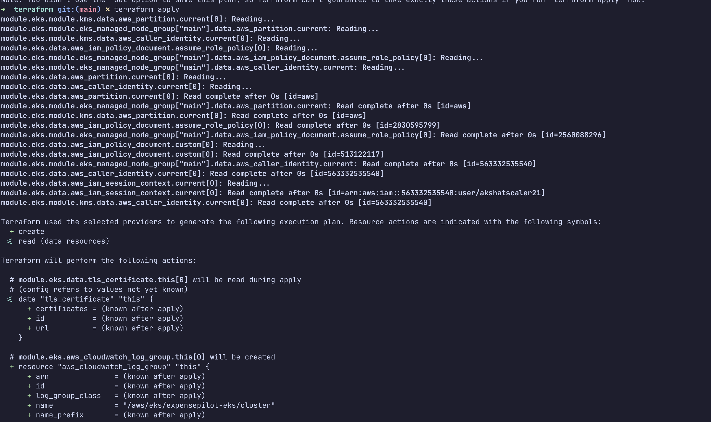

**M7 evidence — apply: IAM roles/policies, `vpc-07a5f1d2f899b784e`, VPC route tables/subnets/SGs:**

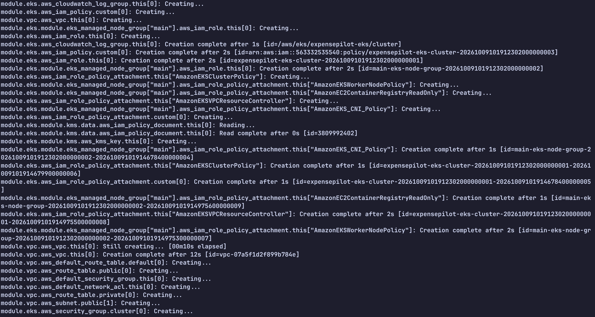

**M7 evidence — apply: `aws_eks_cluster Creating...` + `nat-00c29ab12a93fe8a9` complete after 1m44s:**

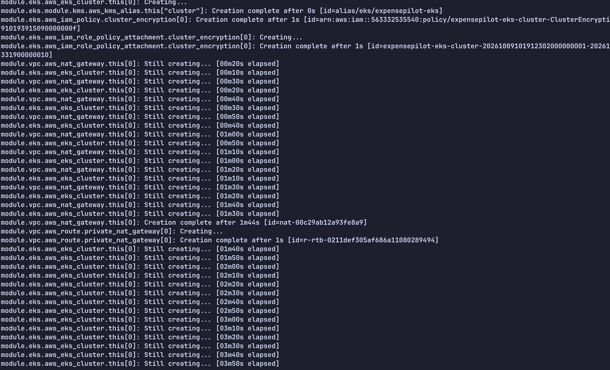

**M7 evidence — `Apply complete! 56 added`, outputs `cluster_name`, `vpc_id`, `cluster_endpoint (ap-south-1)`:**

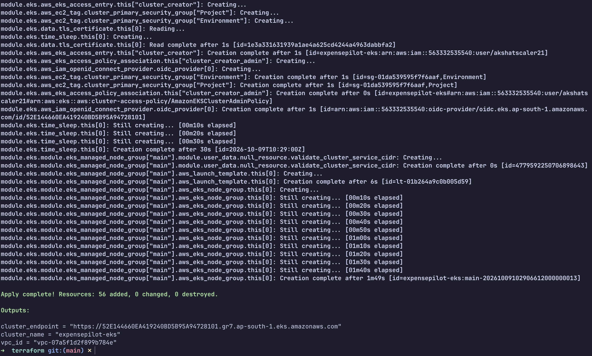
```
```bash
terraform plan -out=tfplan

# 4. Provision infrastructure (Cloud deployment)
terraform apply tfplan

# 5. Configure kubectl with new EKS cluster
aws eks update-kubeconfig --region ap-south-1 --name expensepilot-eks

# 6. Teardown all resources after testing (Mandatory to eliminate cloud costs)
terraform destroy -auto-approve
```

---

## 9. CI/CD Pipeline

The GitHub Actions pipeline (`.github/workflows/ci-cd-devsecops.yml`) runs on every push and pull request to the `main` branch.

```text
+-------------------+
|  1. Build & Test  |  --> Pytest unit tests, Vite frontend compile
+---------+---------+
          │
          ▼
+-------------------+
|  2. DevSecOps     |  --> Gitleaks (Secrets), Bandit (SAST), pip-audit (SCA)
+---------+---------+
          │
          ▼
+-------------------+
|  3. Security Gate |  --> Multi-stage Docker build + Trivy CVE scan (HIGH/CRITICAL)
+---------+---------+
          │  PASS
          ▼
+-------------------+
|  4. GHCR Publish  |  --> Push images tagged with Git SHA to GitHub Container Registry
+---------+---------+
          │
          ▼
+-------------------+
|  5. Deploy & Gate |  --> Helm upgrade --install + kubectl rollout verification
+-------------------+
```

### Key Principles:
- **Quality Gates:** Unit test failures or SAST/SCA/CVE findings immediately abort the pipeline before images are pushed.
- **Traceability:** Every container image is tagged with the exact Git commit SHA (`${{ github.sha }}`), enabling instant provenance tracking from running containers back to source code.

**M5 evidence — 20 runs on `main`, latest green (`M5 CI/CD: push → Actions green`):**

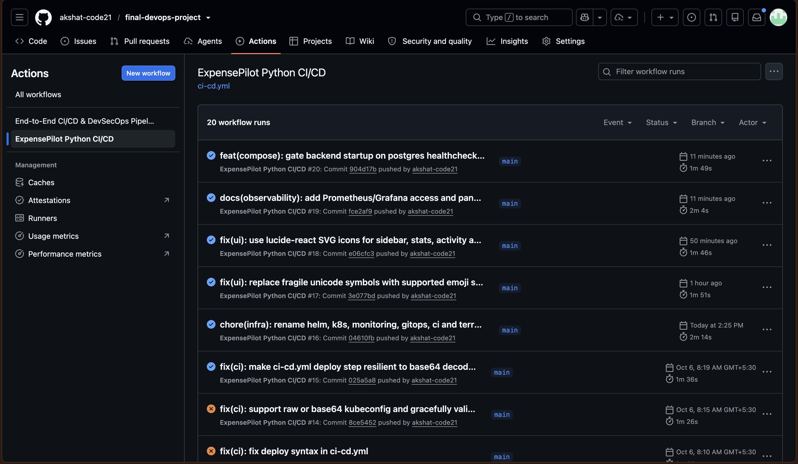

**M6 evidence — run #20 green (`M6 Security: Trivy step log in Actions` — backend+frontend Trivy scans ✓, GHCR `:sha` publish, Helm rollout):**

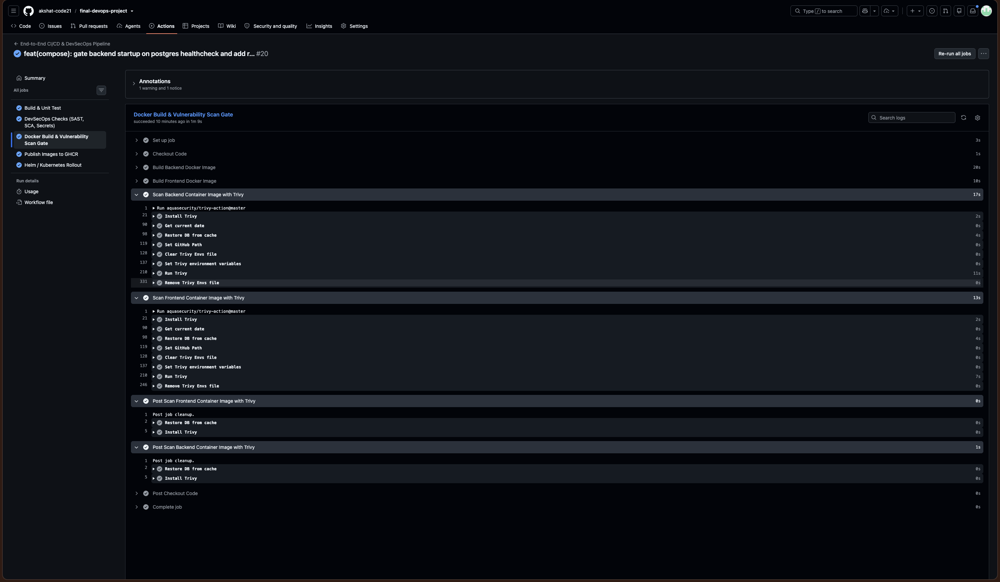

---

## 10. DevSecOps Implementation

Security is shifted left across 5 distinct verification controls:

1. **Secret Scanning (Gitleaks):** Scans git commits and pull request diffs for leaked cloud tokens, database connection strings, and private keys.
2. **SAST (Bandit):** Static analysis for Python source code identifying SQL injection, dangerous shell execution, and improper exception handling.
3. **SCA (pip-audit & npm audit):** Scans backend and frontend dependencies against the National Vulnerability Database (NVD) and GitHub Advisory Database.
4. **Container Image Scanning (Aqua Trivy):** Scans built container images for OS packages (Alpine/Debian) and embedded language libraries with CVEs.
5. **Enforced Security Gate:** The pipeline fails with exit code 1 if any vulnerability with severity `HIGH` or `CRITICAL` without an upstream fix is detected.

Local security scans can be executed with:
```bash
./security/run-security-scans.sh
```

---

## 11. Monitoring & Observability

Observability is implemented using the industry-standard **Prometheus + Grafana** stack:
- **Application Instrumentation:** The backend utilizes `prometheus-fastapi-instrumentator` to automatically record HTTP request counts, response latency histograms, and active requests.
- **Prometheus Scraping:** Prometheus scrapes the `/metrics` endpoint every 15 seconds through the `ServiceMonitor` resource.
- **Grafana Dashboard:** Visualizes 4 golden signals:
  1. HTTP Requests per second (RPS) grouped by endpoint and HTTP status code.
  2. P95 / P99 HTTP Request Latency.
  3. Pod CPU & Memory resource consumption.
  4. HTTP 5xx error rate percentage.
- **Alerting Rules:**
  - `ExpensePilotBackendDown`: Triggers Critical alert if Prometheus fails to scrape backend pods for > 1 minute.
  - `ExpensePilotHigh5xxErrorRate`: Triggers Warning alert if 5xx errors exceed 5% of total traffic.

**M9 evidence — `M9 Observability: curl <backend>/metrics | head` returns Prometheus text:**

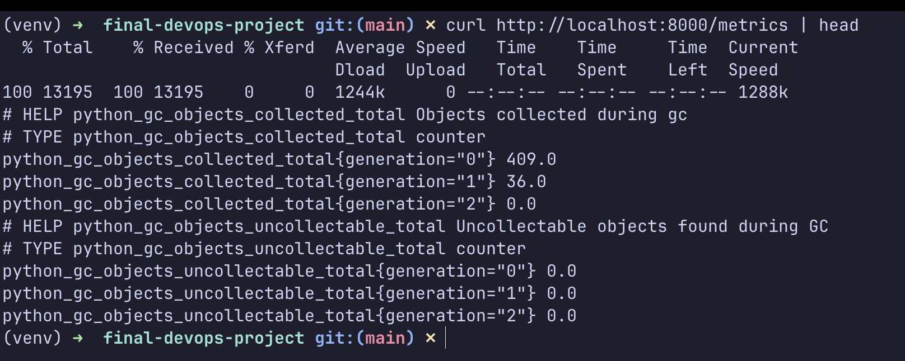

**M9 evidence — Prometheus Targets `up`: backend scrape `1` (`M9: Targets UP`):**

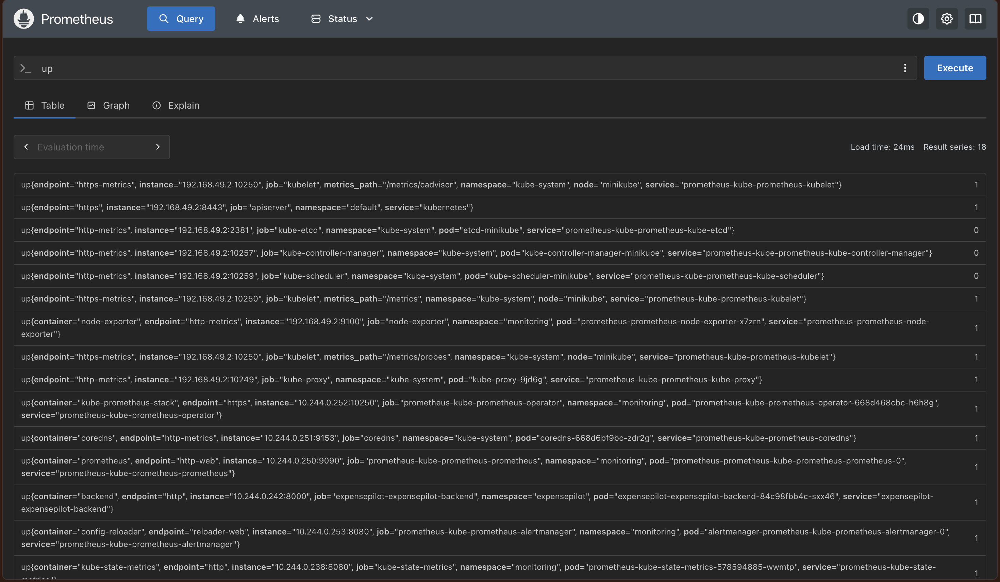

**M9 evidence — Grafana live panel (`M9: dashboard with 1 live panel`, backend `up` series):**

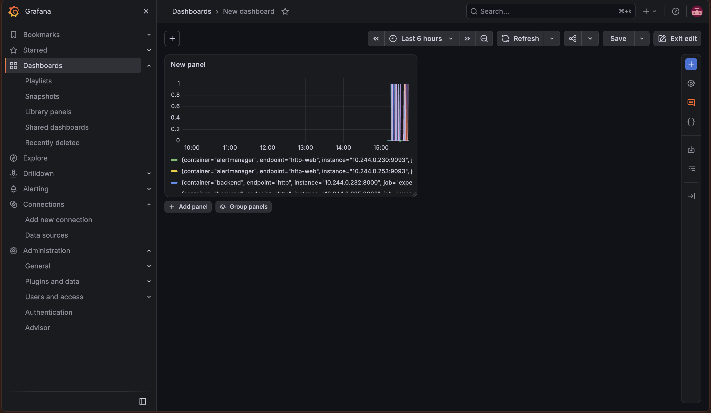

---

## 12. GitOps Workflow

The GitOps implementation utilizes **ArgoCD** to follow the pull-based continuous delivery paradigm:
- The Git repository is configured as the **Single Source of Truth**.
- ArgoCD continuously monitors `helm/expensepilot` in the Git repository.
- When an engineer merges code or the CI pipeline updates image tags in Git, ArgoCD automatically pulls the new manifest and reconciles the cluster state.
- **Self-Healing & Drift Detection:** If an operator manually alters a resource or deletes a pod with `kubectl`, ArgoCD automatically overwrites the drift and restores the desired state declared in Git.

---

## 13. Troubleshooting Lab

The project includes 5 deliberately constructed real-world failure scenarios in `troubleshooting/` with complete diagnostic workflows documented in `troubleshooting/SOLUTIONS.md`:

```text
Incident 1: ImagePullBackOff (Typo in tag / nonexistent repository)
Incident 2: CrashLoopBackOff (Database connection string unreachable)
Incident 3: Service Selector Mismatch (Service has empty endpoints)
Incident 4: PersistentVolumeClaim Unbound (Pod stuck in Pending state)
Incident 5: Ingress 502 Bad Gateway (Port mismatch between Ingress & Service)
```

### Standard 6-Step Troubleshooting Framework
1. **Identify the Issue:** `kubectl get pods -n expensepilot`, check pod status and restart count.
2. **Investigate Logs & Resources:** Run `kubectl describe pod <name>` and `kubectl logs <name> --previous`.
3. **Find the Root Cause:** Pinpoint the exact mismatch (DNS, port, label, or missing volume).
4. **Fix the Issue:** Apply the corrected manifest or patch.
5. **Verify the Solution:** Validate pods reach `Running (1/1)` and HTTP endpoints return `200 OK`.
6. **Document the Post-Mortem:** Record root cause, impact, remediation, and prevention measures.

---

## 14. Screenshots Guide & Evidence Checklist

To fulfill all requirements in the capstone grading rubric (100 points), prepare the following evidence screenshots:

| Module | Required Evidence Screenshot | Command / View | Expected Result |
| :--- | :--- | :--- | :--- |
| **M1** | Running Application in Browser | Browser at `http://localhost:3000` | ExpensePilot UI loaded with expense list, spend totals & stats |
| **M2** | Automated Testing | Terminal: `pytest -v` | 8/8 tests passing in green |
| **M3** | Git Version Control | Terminal: `git log --oneline -n 10` | 10+ clean semantic commits |
| **M4** | Docker Compose Stack | Terminal: `docker compose ps` | postgres, backend, frontend all `Up (healthy)` |
| **M5** | GitHub Actions CI/CD Pipeline | GitHub Actions Run Page | All 5 pipeline stages showing green checkmarks |
| **M5** | GHCR Container Registry | GitHub Packages / GHCR UI | Images published with SHA tags (not `latest`) |
| **M6** | Trivy Security Scan Output | GitHub Actions Trivy step log | Table showing 0 HIGH/CRITICAL vulnerabilities |
| **M7** | Terraform Plan Output | Terminal: `terraform plan` | Plan: X to add, 0 to change, 0 to destroy |
| **M7** | AWS EKS Console / Teardown | AWS Console / `terraform destroy` | EKS Cluster active / clean teardown screenshot |
| **M8** | Kubernetes Running Pods | Terminal: `kubectl get pods -n expensepilot` | All pods in `Running` state (2 frontend, 2 backend, 1 db) |
| **M8** | Kubernetes Services & Ingress | Terminal: `kubectl get svc,ingress,hpa -n expensepilot` | ClusterIPs bound, Ingress host active, HPA active |
| **M8** | Helm Release | Terminal: `helm list -n expensepilot` | Release `expensepilot` in `deployed` status |
| **M9** | Backend Metrics Endpoint | Terminal: `curl http://<backend>/metrics` | Prometheus metrics with `http_requests_total` |
| **M9** | Grafana Observability Dashboard | Browser at Grafana UI | Live dashboards showing RPS, latency, and CPU usage |
| **GitOps**| ArgoCD UI Sync Status | Browser at ArgoCD UI | Application status showing `Synced` and `Healthy` |
| **Lab** | Troubleshooting Verification | Terminal: `kubectl get pods` after fix | Remediated pod returning to `Running` |

**M3 evidence — semantic history (`feat(api): replace Task with Expense model`, `feat(ui): rebuild dashboard as ExpensePilot`, `fix(docker): run frontend as non-root on 8080`, `fix(k8s): envsubst nginx …`, `feat(k8s): enable ingress …`):**

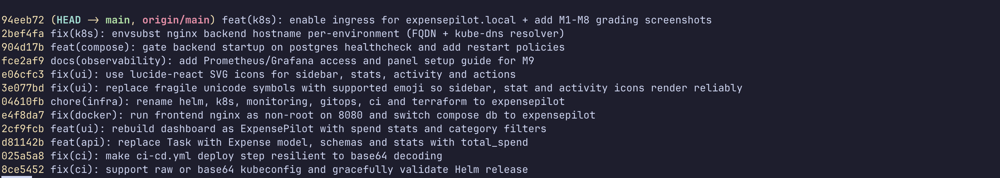

---

## 15. Lessons Learned: What is Required to Do This Assignment Apart from Current Situation

### Gap Analysis: What Was Missing vs What Was Delivered
1. **Directory Structure:** The initial repository had disparate folders (`backend/`, `frontend/`, `k8s/`). We established the unified `final-devops-project/` tree containing all required folders (`application/`, `docker/`, `kubernetes/`, `helm/`, `terraform/`, `.github/`, `security/`, `monitoring/`, `gitops/`, `troubleshooting/`).
2. **Kubernetes Declarative Resources:** The original repo only possessed `namespace.yaml` and Helm templates. We crafted standalone manifests for ConfigMaps, Secrets, PVCs, Deployments, Services, Ingress, and HPAs.
3. **DevSecOps Integration:** Previous workflows only ran an image scan. We created the full DevSecOps suite with Bandit (SAST), pip-audit (SCA), Gitleaks (Secrets), and formal security gating.
4. **GitOps Architecture:** The initial repo had zero GitOps manifests. We implemented ArgoCD Application, AppProject, and repository synchronization configurations.
5. **Troubleshooting Depth:** Expanded from 2 bare files to 5 full failure scenarios with step-by-step post-mortem analysis.

### External Prerequisites Required Outside the Workspace
To execute and submit this capstone project completely, the student requires:
1. **AWS Cloud Account & IAM Credentials:**
   - Active AWS account with an IAM user possessing permissions for VPC, EC2, EKS, NAT Gateway, IAM roles, and CloudWatch.
   - Awareness of AWS costs: Running an EKS cluster with NAT Gateways costs approximately $0.20/hour. Running `terraform destroy` immediately after gathering screenshots is essential.
2. **GitHub Secrets Configuration:**
   - In GitHub repository settings (`Settings -> Secrets and variables -> Actions`):
     - `KUBE_CONFIG_DATA`: Base64 encoded kubeconfig file to allow GitHub Actions to communicate with the EKS cluster.
     - `GITHUB_TOKEN` permissions: Ensure repository workflow permissions are set to "Read and write permissions" so GHCR can store container images.
3. **Cluster Ingress & Networking Controller:**
   - Ingress requires an in-cluster controller (such as `ingress-nginx`).
   - Domain resolution requires updating the local `/etc/hosts` file:
     ```text
     127.0.0.1 expensepilot.local
     ```
4. **Kubernetes Metrics Server:**
   - The HorizontalPodAutoscaler (HPA) requires `metrics-server` installed in the cluster to gather pod CPU utilization. Without it, HPA displays `<unknown>/60%`.
5. **Local Python & Node Environments:**
   - A dedicated Python virtual environment (`python3 -m venv .venv`) with packages from `requirements.txt` is required to run Pytest tests locally before pushing to CI.
